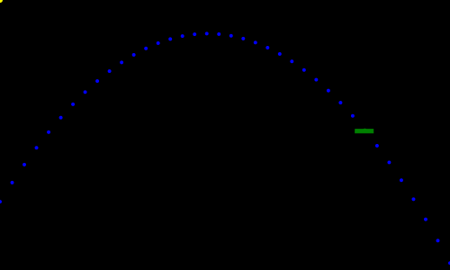
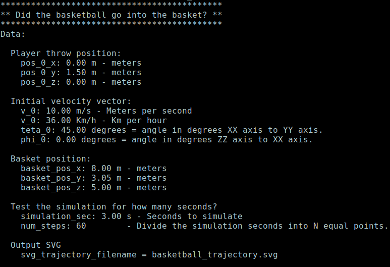
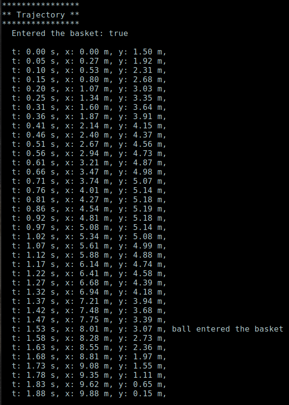

# Basket ball trajectory in Rust
Illustration of a classical physics problem applied to basket.  

## Description
This tries to answer the question if the ball that a basket player throws with a V_0 velocity vector and a Teta angle will enter the basket in a parabolic trajectory? <br>
I made this to illustrate to my daughter that the equations  in her physics book could came out "alive" if they were calculated with a simple program. I applied to basket, a game that my daughter likes. It calculates for each instant t and in the end it draws the trajectory of the ball in a SVG animation and in text mode.


## Trajectory from players and to basketball basket

 <br>
<br>

 <br>
<br>

 <br>


## Equations in 2D:
```
    Uniformed accelerated movement:          
              s = s_0 + v_0 * t - 1/2 * g * t^2
 
    Decomposed movement into is components XX and YY:
              v_0_x = v_0 * cos(teta_0)
              v_0_y = v_0 * sin(teta_0)
 
              ball_pos_x = x_0 + v_0_x * t
              ball_pos_y = y_0 + v_0_y * t - 1/2 * GRAVITY * t^2 

    Euclidean distance 3D:
              dist = sqrt( (p_x - q_x)^2 + (p_y - q_y)^2 + (p_z - q_z)^2 )
```


## References: 
* Wikipedia - Projectile motion <br>
  [https://en.wikipedia.org/wiki/Projectile_motion](https://en.wikipedia.org/wiki/Projectile_motion)


## License 
MIT Open Source License.


## Have fun
Best regards, <br>
João Nuno Carvalho

